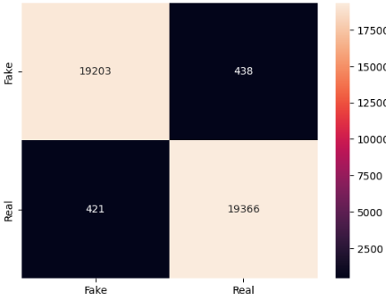
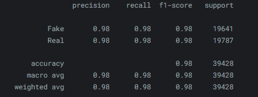
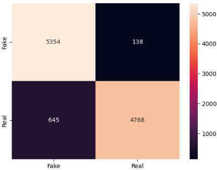
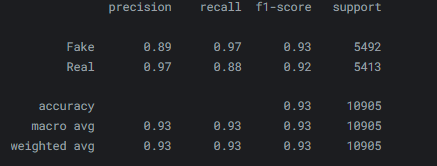
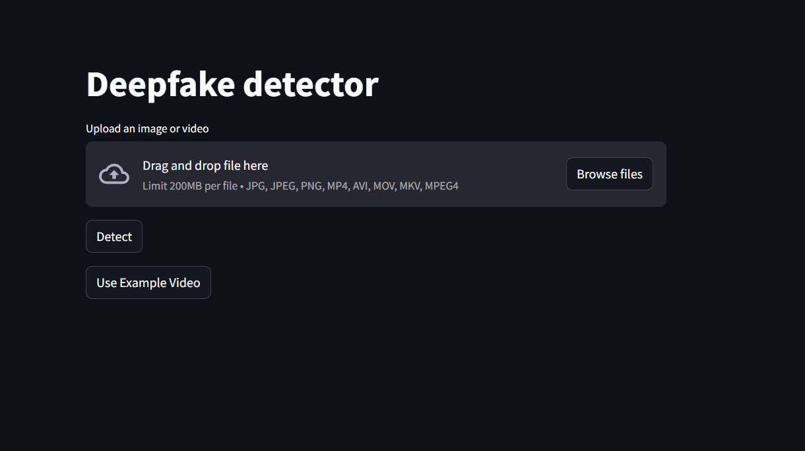

# **Deepfake Detection using Vision Transformer [ Live Application](https://huggingface.co/spaces/ashish-001/Deepfake-Image-Detection)**

This project focuses on detecting deepfake images by fine-tuning a pre-trained Vision Transformer (ViT) model. With the increasing prevalence of deepfake media, this model aims to identify synthetic images with high accuracy, making strides toward ensuring authenticity.

---

## **Project Highlights**

- **Objective**: Detect whether an image is real or a deepfake using a fine-tuned Vision Transformer model.
- **Base Model**: [google/vit-base-patch16-224-in21k](https://huggingface.co/google/vit-base-patch16-224-in21k)
- **Dataset**: [Real and deepfake image dataset](https://www.kaggle.com/datasets/manjilkarki/deepfake-and-real-images).
- **Classes**: Binary classification (`Fake`, `Real`).
- **Key Metrics**:
  - **Validation Accuracy**: 97%
  - **Test Accuracy**: 92%
- **Architecture**:
  - Fine-tuned Vision Transformer for robust feature extraction and classification.

---
## **Results Visualization**

### Validation Dataset
#### Confusion matrix

#### Classification Report


### Test Dataset
#### Confusion matrix

#### Classification Report

---
## **Application Features**
1. **Input Options**:
   - Upload an image or video for deepfake detection.
   - Analyze pre-loaded sample content for demonstration.
2. **Interactive Results**:
   - Displays the uploaded or sample input with bounding boxes and classification labels.
   - Provides predictions with a user-friendly interface.

---
## **Installation**

1. Clone the repository:
   ```bash
   git clone https://github.com/Ashish-C01/deepfake-image-detection.git
   cd deepfake-image-detection
   ```

2. Install dependencies:
    ```bash
    pip install -r requirements.txt
    ```
3. Run the Streamlit application:
    ```bash
    streamlit run app.py
    ```

---
## **Sample Video**
A pre-loaded sample video is included for demonstration purposes.  
[Watch the video on YouTube](https://www.youtube.com/watch?v=CDMVaQOvtxU)
